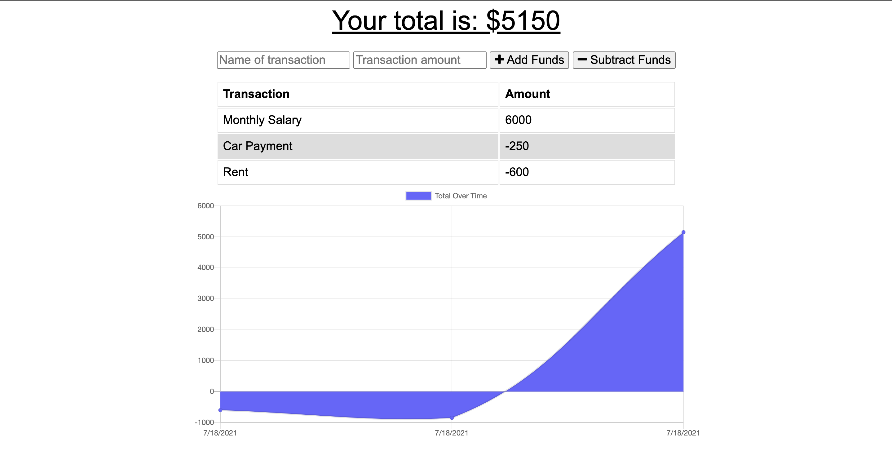

# Budget Tracker [](http://unlicense.org/)

## Description
This project updates the application `Budget Tracker`, and provides it offline functionality for users. This offline access is enabled through the use of service-workers and IndexedDB.

## Table of Contents
1. [Description](#description)
2. [Technologies](#Technologies)
3. [Installation](#installation)
4. [Usage](#usage)
5. [Screenshots](#Screenshots)
6. [License](#License)
7. [Contributing](#Contributing)
8. [Author](#Author)

## Technologies
```
JavaScript | Node.js | Express.js | MongoDB | Mongodb Atlas | Mongoose | Heroku | Service Workers | IndexedDB | Manifest | Chart.js | Bootstrap | Compression | Morgan
```

## Installation
1. Clone the repo locally.
```
  $ git clone <SSH Link>
```
2. Install the npm packages at root of application.
```
  $ npm install
```

## Usage
* Local
1. Initiate the server at the root of the application.
```
  $ npm start
```
2. Visit http://localhost:3001/ in your browser.
3. From here you can start using the Budget Tracker. Insert `Name of transaction` and `Transaction amount` and click `Add Funds` or `Subtract Funds` at the top of the app. After finishing the form, the `Total Over Time` graph will update with your new transaction.

* Heroku
1. Viset the deployed application [here](https://ronan-budget-tracker.herokuapp.com/).
2. From here you can start using the Budget Tracker. Insert `Name of transaction` and `Transaction amount` and click `Add Funds` or `Subtract Funds` at the top of the app. After finishing the form, the `Total Over Time` graph will update with your new transaction.

## Screenshots 


## License
This project is in the public domain and free for any and all users! For more information on this (un)licensing statement, visit [unlicense.org](https://unlicense.org/).

## Contributing
* If you'd like to contribute to this project, please follow the rules of the [Contributor Covenant](https://www.contributor-covenant.org/).

## Author
* This application was written and developed by Ronan Galvez as part of the UCF Coding Bootcamp.
* For any inquiries/suggestions/concerns, open an issue in the [project repo](https://github.com/Ronan-Codes/budget-tracker.git) or contact me directly at [galv.ronan@gmail.com](galv.ronan@gmail.com).
* Check out the rest of my work on GitHub at [Ronan-Codes](https://github.com/Ronan-Codes).